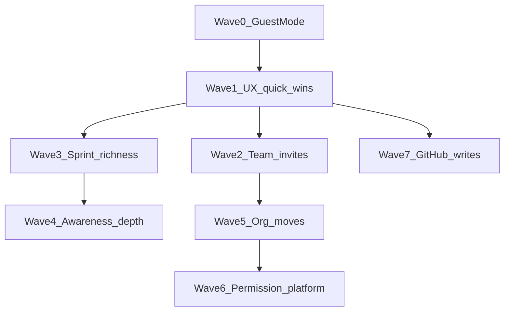

# Deferred roadmap: order and size

Source: [docs/SPEC.md](docs/SPEC.md) — **Deferred / later**, **Ideas to revisit (Command Palette)**, **Deferred from Figma Make**. Plus **Guest Mode** (Progress ⬜) as Wave 0, per your choice.

**Sizing legend** (effort for one focused slice; “needs own plan” = separate grilling + implementation plan later):

| Size | Rough effort            | Own plan?                                 |
| ---- | ----------------------- | ----------------------------------------- |
| XS   | hours                   | no — do in a small PR                     |
| S    | 1–2 days                | optional short checklist                  |
| M    | 3–5 days / 1 PR cluster | **yes** — light plan                      |
| L    | 1–2 weeks               | **yes** — full plan + ADR if domain moves |
| XL   | multi-week / platform   | **yes** — ADR + phased plan               |

**Do not start** items marked _Rejected / dead_ unless product reopens them.

---

## Wave 0 — Guest Mode (prerequisite)

| Item                                                              | Size     | Own plan | Why here                                                                                     |
| ----------------------------------------------------------------- | -------- | -------- | -------------------------------------------------------------------------------------------- |
| Guest Mode (demo user, seed, login CTA, fake git/CI where needed) | **L–XL** | **yes**  | Portfolio-critical; unlocks “Guest-specific palette”; touches auth shell, seed, Git/CI seams |

Depends on: existing auth + MainLayout. Unlocks: Deferred palette guest behaviour. Finish Mentions polish / #159 (delete empty Team) opportunistically outside this map — they are near-done, not Deferred.

---

## Wave 1 — High value / low risk UX (no new domain)

Small, independent; ship in any order inside the wave. Softens polish debt; almost no RLS risk.

| Item                                             | Source     | Size     | Own plan | Notes                                                              |
| ------------------------------------------------ | ---------- | -------- | -------- | ------------------------------------------------------------------ |
| Palette: Navigate to Board / Git / CI / Settings | Palette    | **S**    | no       | Extends command rules seam; launcher only                          |
| Palette: Separate Create bug / feature           | Palette    | **XS–S** | no       | Pass `type` into existing Create Task                              |
| Palette: Remember last Board per Project         | Palette    | **S**    | no       | localStorage / preference + Switch Project                         |
| Palette: Include archived in search              | Palette    | **S**    | no       | Toggle or filter; reuse Board archive semantics                    |
| Palette: Search Members                          | Palette    | **S–M**  | light    | Team members query + navigate                                      |
| Header **+ New Task** board CTA                  | Figma Make | **XS–S** | no       | Optional CTA; columns already create                               |
| Flat all-Projects home                           | Deferred   | **S–M**  | light    | Read-only cross-Team list; Home stays Teams-first                  |
| Projects without GitHub                          | Deferred   | **M**    | **yes**  | Schema null OK; create flow + gate Git/CI UI for nameless projects |

**Skip / already decided (not waves):**

| Item                                                  | Verdict                                      |
| ----------------------------------------------------- | -------------------------------------------- |
| Cmd+K in chrome                                       | Already MVP (TopBar) — ignore Make placement |
| Make dock primary nav                                 | Superseded by TopBar tabs                    |
| Drawer DIFF PREVIEW / RECENT COMMITS as Make sections | Keep Git tab; ADR 0007                       |
| Two-column Make drawer                                | Skin-only reference; no restructure          |

---

## Wave 2 — Team invites & email (collab growth)

Builds on ADR 0017 Team model (`team_invites`). Order inside wave matters.

1. **Open invite link (no email binding)** — **M**, own plan. Schema/UX fork from email-targeted invites; RLS redeem path.
2. **Custom SMTP / real invite emails** — **M**, own plan. Ops (Resend etc.) + Edge Function/template; product still email-addressed.
3. **GitHub collaborator auto-suggest** — **M**, own plan. On repo connect: GH collaborators API → “Add to Team” → existing invite/member flows.

Why this order: open link is pure product/RLS; SMTP is ops; GH suggest composes invites + GitHub token already used at connect.

---

## Wave 3 — Sprint richness (linear dependency chain)

Do **not** jump to burndown/KPI first.

1. **Column `is_done` flag** — **S–M**, light plan. Unblocks honest Close completion; schema on `board_columns` + Close UI.
2. **Per-task carryover targets on Close** — **M**, own plan. Close dialog state machine; more UX than schema.
3. **Story points / estimates on Tasks** — **M–L**, own plan + short ADR/CONTEXT update. Schema + card/drawer + count→points reports.
4. **Sprint burndown chart** — **L**, own plan. Needs points **or** deliberate time-series design; after (3).
5. **Sprint KPI / velocity dashboards** — **L–XL**, own plan. Corporate metrics; after (3)+(4).

---

## Wave 4 — Awareness depth (notifications / mentions)

After Mentions MVP is stable.

| Item                                      | Size    | Own plan | Notes                                                   |
| ----------------------------------------- | ------- | -------- | ------------------------------------------------------- |
| Group Mentions (`@everyone` / Roles)      | **M–L** | **yes**  | Expand ADR 0014; membership resolution + fan-out volume |
| Comment events without Mention            | **M**   | **yes**  | Product volume decision; Watch vs always-on             |
| Palette: Search Task description / Labels | **M**   | light    | FTS/ilike cost on Free; after or with awareness polish  |
| Guest-specific palette behaviour          | **S**   | no       | **After Wave 0**; narrow command set for demo user      |

---

## Wave 5 — Org topology (rare, careful)

| Item                                | Size     | Own plan      | Notes                                                                             |
| ----------------------------------- | -------- | ------------- | --------------------------------------------------------------------------------- |
| Merge / move Projects between Teams | **L–XL** | **yes** + ADR | Membership, `github_repo_id` uniqueness, board URLs, audit; easy to get RLS wrong |

Prefer after Wave 2 (stable Team invites/settings). Low frequency for portfolio demo — later than sprints polish if capacity is tight.

---

## Wave 6 — Permission platform (expensive; late)

| Item                                 | Size   | Own plan      | Notes                                                                             |
| ------------------------------------ | ------ | ------------- | --------------------------------------------------------------------------------- |
| Assigned-only Contributor edits      | **M**  | **yes**       | Was **rejected for MVP**; revisit only with clear pain. RLS + every mutation path |
| Board-level permission overrides     | **XL** | **yes** + ADR | Breaks “Team Role applies everywhere”; policies explode                           |
| Granular permission flags per Member | **XL** | **yes** + ADR | Capability matrix; supersedes simple roles mentally                               |

**Recommended stance:** leave until Team Role model hurts for real multi-board orgs. Do Assigned-only before Board overrides if anything.

---

## Wave 7 — GitHub write API (product bet)

| Item                                | Size   | Own plan      | Notes                                                                      |
| ----------------------------------- | ------ | ------------- | -------------------------------------------------------------------------- |
| In-app PR merge / approve / open PR | **XL** | **yes** + ADR | Token scopes, App permissions, error UX, idempotency; today view/sync only |

Do after Wave 1 Git surface is solid; independent of sprints/permissions. High risk / medium portfolio signal vs webhook+diff already shipped.

---

## Figma Make — board chrome ideas (parked)

Not scheduled unless Product explicitly adds Board UX features:

| Item                       | Size if ever | Own plan                          |
| -------------------------- | ------------ | --------------------------------- |
| **Group by** board control | **L**        | yes — new board aggregation model |
| **Display** board control  | **M–L**      | yes — density/fields preferences  |

Treat as product invention, not “finish Make redesign.”

---

## Suggested “when to write an implementation plan”

Pull items **out of Deferred into a focused plan** in this pull order (balanced):

1. Guest Mode (Wave 0)
2. Projects without GitHub
3. Open invite link → then SMTP → then GH collaborator suggest
4. `is_done` → points (burndown only after points locked)
5. Group Mentions (if awareness continues)
6. Move Projects between Teams (only if org pain shows)
7. Permission XL / in-app PR writes last — only with explicit product pull

**Batch without heavy plans:** Wave 1 palette+CTA items — one epic issue or a few small PRs with a checklist is enough.

---

## Out of this map

- Current near-done: Mentions polish, Team #159 — finish before/parallel to Wave 0.
- Progress “Git integration In progress” — close that before Wave 7, not blocking Waves 0–3.
