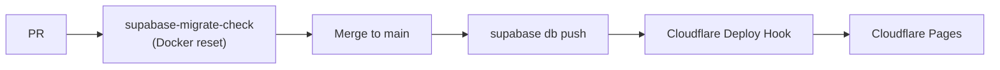

# PlotOps


**Live app:** [https://plotops.webrunner.dev](https://plotops.webrunner.dev) — production deploy (GitHub / email sign-in, real teams and boards). If you only want a look around, use **Try demo** on that page — no account, data stays in this browser session.

[](https://plotops.webrunner.dev)
[](https://github.com/WebRunnerDev/PlotOps/actions/workflows/supabase-migrate-check.yml)
[](https://github.com/WebRunnerDev/PlotOps/actions/workflows/supabase-migrate.yml)
[](LICENSE)
[](https://react.dev/)
[](https://www.typescriptlang.org/)
[](https://vite.dev/)
[](https://supabase.com/)
[](https://tailwindcss.com/)

**Git-native project tracker** — a Linear/Jira-style board where tasks, branches, pull requests, and CI runs live in one place. Built as an open portfolio project to showcase modern frontend architecture (React 19, TanStack, Feature-Sliced Design) with a real Supabase backend, GitHub integration, and production-minded GitOps (branch rulesets, migration gates, agent-assisted triage).

Stay on the board instead of tab-hopping: link a task to a branch, review diffs in-app, watch GitHub Actions status, and let webhooks move cards when a PR merges.

Collaboration is scoped to a **Team**; Projects live under a Team ([ADR 0017](docs/adr/0017-team-above-project.md)). Full product/tech spec: [`docs/SPEC.md`](docs/SPEC.md). Domain glossary: [`CONTEXT.md`](CONTEXT.md).

## Features

| Area                                                                                | Status      |
| ----------------------------------------------------------------------------------- | ----------- |
| Auth (GitHub OAuth + email signup/confirm + complete profile)                       | Done        |
| Guest mode (local sandbox — “Try demo”, no shared remote login)                     | Done        |
| GitHub project import                                                               | Done        |
| Kanban board (columns, labels, priority, deadline, filters, comments, soft-archive) | Done        |
| Multi-board + branch mapping (base branch, allowed head patterns)                   | Done        |
| Sprints (board-scoped backlog, start/close/cancel, report, estimates)               | Done        |
| Task rich text + media (TipTap, Storage)                                            | Done        |
| Task activity feed                                                                  | Done        |
| Team & permissions (Team above Project — ADR 0017)                                  | Done        |
| Notifications (Watch + assignment + structural kinds)                               | Done        |
| Mentions (`@` in description/comments → always-on inbox)                            | Done        |
| App chrome (top bar, project tabs, breadcrumbs)                                     | Done        |
| Command palette (`Ctrl/Cmd+K`)                                                      | Done        |
| CI/CD dashboard (GitHub Actions — jobs, logs, polling)                              | Done        |
| GitHub webhooks + Edge Function (PR merge → task column sync)                       | Done        |
| Git integration (PR link, in-app diff, Open PR + Merge)                             | Done        |
| Deeper Git polish (commits history, UX refinements)                                 | In progress |

### Roadmap highlights

- **Git Kanban** — tasks linked to branches; drag-and-drop updates status; branch name generator (`feature/TASK-123-login-page`)
- **In-app Git** — PR list, commit history, code diff viewer without leaving the app
- **CI/CD Dashboard** — build status per branch, jobs + streaming logs from GitHub Actions
- **Command Palette** — search tasks, create tasks, switch projects, toggle theme
- **Guest Mode** — try the app without GitHub OAuth; client-side sandbox with pre-seeded data

## Why use PlotOps?

PlotOps is a **personal / portfolio product**, not a hosted SaaS competitor to Linear or Jira. It is still useful day-to-day if your work already lives next to GitHub.

### Practical benefit

Most trackers treat Git as an afterthought: you jump out to GitHub for the branch, the PR, the Actions run, then back to update the card. PlotOps keeps that loop on one board:

| Pain today                         | What PlotOps does                                                          |
| ---------------------------------- | -------------------------------------------------------------------------- |
| Card ≠ branch / PR                 | Link a Task to a branch and PR; generate a branch name from the Task       |
| “Did the build pass?” → new tab    | CI/CD tab reads GitHub Actions (jobs + logs) for the linked repo           |
| Merge happened, board is stale     | Webhook moves the Task when a PR merges onto the Board’s base branch       |
| Review means leaving the tracker   | In-app diff, Open PR, and Merge from the Task panel                        |
| Small team, no need for enterprise | Teams, roles, invites, sprints, estimates — enough for a real side project |

### Who it fits

- **You + 1–5 collaborators** on a GitHub-backed side project or small product
- Developers who want a **Linear-like board** without paying for another cloud workspace yet
- Friends / colleagues willing to try a pet project and give blunt feedback
- Hiring managers / peers reviewing a **full-stack portfolio** (real backend, RLS, Edge Functions, GitOps — not a mock landing page)

### Who it does not fit (yet)

- Companies that need SLAs, SSO, audit exports, or “never lose data” guarantees
- Non-git workflows (PlotOps is intentionally Git-native)
- Anyone expecting a finished commercial product — see [Disclaimer](#disclaimer)

### How to try it with friends

1. Open **[https://plotops.webrunner.dev](https://plotops.webrunner.dev)** and sign in with GitHub or email — that is the real app (teams, boards, GitHub-linked projects).
2. For a no-signup walkthrough, use **Try demo** on the same site (Guest Session in this browser; nothing hits production DB). Same button locally via `npm run dev`.
3. After sign-in, create a **Team**, invite people, connect a repo, and use a real Board for one shared project.
4. Tell them up front: pet project, expect rough edges, feedback welcome — delete-account path is documented in the Disclaimer.

## Domain (MVP)

| Term              | Meaning                                                                                 |
| ----------------- | --------------------------------------------------------------------------------------- |
| **Project**       | Unit of ownership and collaboration (members, boards, tasks, linked GitHub repo)        |
| **Board**         | Kanban workflow inside a Project; owns columns, base branch, and allowed head patterns  |
| **Task**          | Unit of work on exactly one Board; may link a Git branch and/or PR; optional Sprint     |
| **Sprint**        | Board-scoped timebox (`draft` → `active` → `closed` \| `canceled`); ≤1 Active per Board |
| **Backlog**       | Tasks on a Board with no Sprint assignment                                              |
| **Member / Role** | Project membership with Admin, Manager, Contributor, or Viewer                          |
| **Owner**         | `projects.owner_id` — full control; not a `project_members` row                         |
| **Invite**        | Email-addressed join offer; copy-link delivery (no SMTP in MVP)                         |
| **Watch**         | Personal subscription to curated structural Task events                                 |
| **Mention**       | Structured `@` reference in Description/Comment → always-on Notification                |

See [`CONTEXT.md`](CONTEXT.md) for full glossary and role capabilities.

## Tech Stack

| Layer        | Choice                                                         |
| ------------ | -------------------------------------------------------------- |
| Build        | Vite 8                                                         |
| UI           | React 19, Tailwind CSS 4, shadcn/ui                            |
| Routing      | TanStack Router                                                |
| Server state | TanStack Query                                                 |
| UI state     | Zustand (when needed)                                          |
| i18n         | i18next                                                        |
| Backend      | Supabase (PostgreSQL, Auth, Realtime, Storage, Edge Functions) |
| Architecture | Feature-Sliced Design                                          |

```
src/
  app/        # bootstrap, router, global styles, i18n
  routes/     # TanStack Router file-based routes
  features/   # auth, tasks, boards, sprints, git-integration, …
  shared/     # api, ui kit, lib utilities
```

## Engineering practices

Portfolio signal beyond the UI: the repo is operated like a small product — protected `main`, schema-before-frontend deploys, ADRs, and an agent-ready issue pipeline.

### Branch protection & merge gates

GitHub **Ruleset** on the default branch (`main`):

| Rule                        | Effect                                              |
| --------------------------- | --------------------------------------------------- |
| Block force-push / deletion | `main` cannot be rewritten or removed               |
| Required check              | **`supabase-migrate-check`** must pass before merge |

PR workflow ([`.github/workflows/supabase-migrate-check.yml`](.github/workflows/supabase-migrate-check.yml)): path-filtered — when `supabase/migrations/**` (or related paths) change, Actions starts a fresh local Supabase stack and runs `db reset` so broken SQL never lands on `main`.

### CI/CD — migrate, then ship

Remote schema is **not** pushed from laptops day-to-day ([ADR 0016](docs/adr/0016-migrations-via-ci.md)). Happy path:



1. **PR** — migration check on a clean DB (required status check).
2. **`main` push** — [`supabase-migrate`](.github/workflows/supabase-migrate.yml) links PlotOps, runs `supabase db push`, then POSTs the Cloudflare Pages Deploy Hook.
3. **Cloudflare** — automatic production deploys stay off so the UI never races ahead of schema.

Local safety net: **Husky** on pre-commit — **gitleaks** (`protect --staged`) then **lint-staged** (ESLint `--fix`, Prettier). Hooks install via `npm install` → `prepare`. If gitleaks’ postinstall was blocked, run `npm rebuild @b12k/gitleaks` (or `npm approve-scripts @b12k/gitleaks` then rebuild).

Details / secrets: [`docs/SUPABASE.md`](docs/SUPABASE.md).

### Agent-assisted delivery & security review

Work is tracked as **GitHub Issues** (`gh`), not ad-hoc chat notes. Repo conventions live in [`AGENTS.md`](AGENTS.md) and [`docs/agents/`](docs/agents/):

| Practice       | What it looks like                                                                       |
| -------------- | ---------------------------------------------------------------------------------------- |
| Triage labels  | `needs-triage` → `needs-info` → `ready-for-agent` / `ready-for-human` / `wontfix`        |
| Spec → tickets | Skills publish PRDs / tracer-bullet tickets as issues; Wayfinder maps + sub-issues       |
| Feature audit  | `/audit` reviews a path and opens findings as Issues                                     |
| PR agents      | Cursor **Bugbot** (regression pass) and **Security Review** on local / branch diffs      |
| Domain lock    | Ubiquitous language in [`CONTEXT.md`](CONTEXT.md); decisions in [`docs/adr/`](docs/adr/) |

Agents are instructed to verify migrations on **local Docker** and leave remote apply to CI — same rule as humans.

## Getting Started

### Prerequisites

- Node.js 20+
- Docker Desktop (for local Supabase)
- A [Supabase](https://supabase.com) project (remote PlotOps, or local Docker only)
- (Optional) Supabase CLI for migrations: `npx supabase login`

### Setup

```bash
npm install
cp .env.example .env
```

Fill in `.env` (remote PlotOps):

```env
VITE_SUPABASE_URL=https://<project-ref>.supabase.co
VITE_SUPABASE_PUBLISHABLE_KEY=your_supabase_publishable_key
```

**Local DB (Docker)** — default place to create and verify migrations (do not push schema from your laptop):

```bash
# Docker Desktop must be running
npm run db:start
# keys are printed; or copy from npm run db:local-status into .env.local
npm run db:new -- <name>  # add migration under supabase/migrations/
npm run db:reset          # re-apply all migrations from scratch
npm run dev               # uses .env.local over .env
```

Optional local GitHub OAuth: set `SUPABASE_AUTH_EXTERNAL_GITHUB_CLIENT_ID` / `SECRET` in `.env.local` (separate OAuth App; callback `http://127.0.0.1:54321/auth/v1/callback`). See `.env.example`.

Remote schema is applied by **CI/CD** after merge. Do not run `npm run db:push` in day-to-day work (emergency / explicit ask only). See [`docs/SUPABASE.md`](docs/SUPABASE.md).

### Develop

```bash
npm run dev
```

With `.env.local` present, the app talks to local Supabase (`127.0.0.1:54321`). Without it, `.env` (remote) is used. See `docs/SUPABASE.md`.

### Other scripts

| Script                         | Purpose                                       |
| ------------------------------ | --------------------------------------------- |
| `npm run build`                | Typecheck + production build                  |
| `npm run typecheck`            | TypeScript project build check                |
| `npm run lint`                 | ESLint                                        |
| `npm run format`               | Format with Prettier                          |
| `npm test`                     | Run Vitest once                               |
| `npm run test:watch`           | Vitest watch mode                             |
| `npm run db:status`            | List remote vs local migrations (read-only)   |
| `npm run db:start` / `db:stop` | Local Supabase (Docker)                       |
| `npm run db:reset`             | Reset local DB from migrations                |
| `npm run db:local-status`      | Local URL + keys                              |
| `npm run db:new -- <name>`     | Create a new migration                        |
| `npm run db:push`              | Emergency remote apply only (not day-to-day)  |
| `npm run shadcn:add -- <name>` | Add a shadcn/ui component                     |
| `npm run shadcn:exports`       | Regenerate shadcn barrel exports              |
| `npm run secrets:scan`         | gitleaks on staged files (same as pre-commit) |
| `npm run secrets:scan:history` | gitleaks full git history scan                |

Pre-commit (Husky): gitleaks on staged changes, then lint-staged (ESLint `--fix` + Prettier). Hooks install via `npm install` (`prepare`).

## Design

Dark, strict, Linear / Neobrutalism-inspired: sharp borders, monospace for git elements, neon accents on build statuses. Typography tokens (`text-h1` … `text-meta`) live in `src/app/styles/index.css` — Space Grotesk, IBM Plex Sans, JetBrains Mono.

## Docs

| Doc                                                                        | Contents                                                                 |
| -------------------------------------------------------------------------- | ------------------------------------------------------------------------ |
| [`docs/SPEC.md`](docs/SPEC.md)                                             | Product & technical specification, progress, roadmap                     |
| [`CONTEXT.md`](CONTEXT.md)                                                 | Ubiquitous language (Project, Board, roles, invites, …)                  |
| [`docs/SUPABASE.md`](docs/SUPABASE.md)                                     | Supabase project / CLI; migrate-check + CI secrets; branch ruleset notes |
| [`docs/adr/0016-migrations-via-ci.md`](docs/adr/0016-migrations-via-ci.md) | Why remote schema applies only via Actions + Deploy Hook                 |
| [`docs/github-webhook-setup.md`](docs/github-webhook-setup.md)             | GitHub App + webhook Edge Function setup                                 |
| [`docs/adr/`](docs/adr/)                                                   | Architecture decision records                                            |
| [`AGENTS.md`](AGENTS.md) / [`docs/agents/`](docs/agents/)                  | Issue tracker, triage labels, Wayfinder, domain docs for agents          |

## Disclaimer

PlotOps is a portfolio / demo project, not a commercial service. Account data (first name, last name, email, GitHub profile fields) is stored with third-party providers (including Supabase) outside Kazakhstan. Use at your own risk. To request deletion of your account or personal data, open a GitHub issue on this repository or contact the repository owner.

## License

This project is licensed under the [MIT License](LICENSE).
