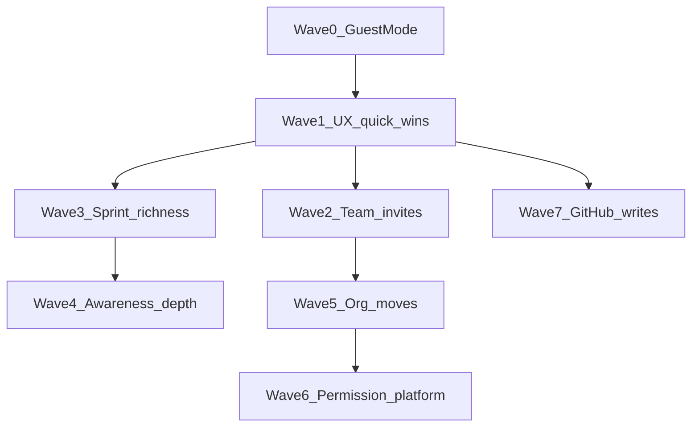

# Deferred roadmap (order & size)

Ordered pull guide for items listed under **Deferred** in [`docs/SPEC.md`](../SPEC.md). Do **not** implement a wave until product explicitly pulls it; use the nested plans when that happens.

**Sizing:** XS (hours) · S (1–2d) · M (3–5d) · L (1–2w) · XL (multi-week). M+ usually needs its own focused plan before coding.

| Wave | Theme                                                         | Plans                                                                             |
| ---- | ------------------------------------------------------------- | --------------------------------------------------------------------------------- |
| 0    | Guest Mode (prerequisite)                                     | [wave-0-guest-mode.md](./wave-0-guest-mode.md) — **L–XL**                         |
| 1    | UX quick wins (palette, CTA, home, no-GH projects)            | [wave-1-ux-checklist.md](./wave-1-ux-checklist.md) — mostly **XS–S**; no-GH **M** |
| 2    | Team invites & email                                          | [wave-2-team-invites.md](./wave-2-team-invites.md) — **M** × 3                    |
| 3    | Sprint richness (linear chain)                                | [wave-3-sprint-richness.md](./wave-3-sprint-richness.md) — **S→XL**               |
| 4+   | Awareness, org moves, permissions, GitHub writes, parked Make | [wave-4-plus-later.md](./wave-4-plus-later.md) — pull only with pain              |

### Suggested pull order (balanced)

1. Guest Mode (Wave 0)
2. Projects without GitHub (Wave 1 M item)
3. Open invite → SMTP → GH collaborator suggest (Wave 2)
4. `is_done` → points (burndown only after points; Wave 3)
5. Group Mentions if awareness continues (Wave 4)
6. Move Projects between Teams only if org pain (Wave 5)
7. Permission XL / in-app PR writes last (Waves 6–7)

Finish Mentions polish and Team #159 opportunistically outside this map — near-done, not Deferred. Close Git integration Progress before Wave 7.
