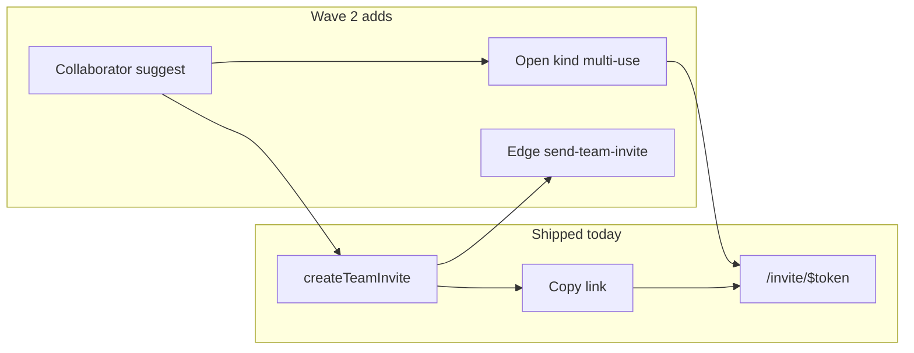

# Wave 2 — Team invites & email (implementation plan)

**Size:** M each · **Order inside wave is fixed** · **Depends on:** ADR 0017 Team model (`team_invites`, Team settings).

Do not start until explicitly pulled. Prefer after Wave 1 noise settles; Guest Mode not required. Locked decisions below replace earlier “grill notes”; no product code until pull.

---

## Locked decisions

| Topic             | Choice                                                                              |
| ----------------- | ----------------------------------------------------------------------------------- |
| Open invite model | Column `kind` (`email` \| `open`); multi-use until TTL; no `max_redemptions` in MVP |
| Default open role | Contributor; Admin role on create = Owner-only (ADR 0004)                           |
| Email send        | After `createTeamInvite`, client/hook invokes Edge Function (no DB webhook)         |
| GH without email  | Skip email invite for that person; offer one Team open link (copy) / skip           |

---

## Current baseline (already shipped)

Email-addressed Team invites + copy-link + redeem Accept/Claim/Confirm:

| Area           | Location                                                                                                                                                                      |
| -------------- | ----------------------------------------------------------------------------------------------------------------------------------------------------------------------------- |
| Schema / RPCs  | [`supabase/migrations/20260803130716_team_above_project_schema.sql`](../../supabase/migrations/20260803130716_team_above_project_schema.sql) (`team_invites.email` NOT NULL)  |
| Hardening      | `20260806063329_harden_claim_team_invite_claimed_by.sql`, `20260806063416_harden_get_team_invite_by_token_preview.sql`                                                        |
| SQL tests      | [`supabase/tests/team_invites_test.sql`](../../supabase/tests/team_invites_test.sql), [`team_schema_test.sql`](../../supabase/tests/team_schema_test.sql)                     |
| API / hooks    | [`src/features/teams/api/team-members-api.ts`](../../src/features/teams/api/team-members-api.ts), [`use-team-members.ts`](../../src/features/teams/model/use-team-members.ts) |
| UI             | [`team-members-settings.tsx`](../../src/features/teams/ui/team-members-settings.tsx), [`invite.$token.tsx`](../../src/routes/invite.$token.tsx)                               |
| Edge Functions | Only `github-webhook` — no mail path                                                                                                                                          |
| Domain         | ADR 0002 (copy-link), 0003 (redeem/confirm), 0004 (Owner-only admin), 0017 (Team boundary)                                                                                    |

---

## 2.1 Open invite link (no email binding) — **M**

### Goal

Role + TTL link anyone signed-in can redeem — separate from email-targeted Invites (ADR 0002/0003 remain for email invites).

### Schema

Migration via `npx supabase migration new team_open_invites` (never invent filenames):

- Add `kind text not null default 'email' check (kind in ('email','open'))`
- Make `email` nullable; replace nonempty check with: `(kind = 'email' and length(trim(email)) > 0) or (kind = 'open' and email is null)`
- Unique pending email index remains **partial** for `kind = 'email'` only
- Observability: `redeem_count int not null default 0` (no cap in MVP)
- Open rows stay `pending` until revoke/expire — do **not** set `accepted` on redeem

### RPCs

- Extend `get_team_invite_by_token` preview: include `kind`; for open never expose a fake email; `email_matches` irrelevant
- Branch `accept_team_invite`: if `kind = 'open'` → any signed-in non-member (not already owner/member) inserts `team_members`, increments `redeem_count`, invite stays `pending`
- `claim_team_invite` / `confirm_team_invite`: reject open kind (email ADR 0003 path unchanged)
- Create path (RLS insert): open invites require `can_manage_team_members`; Admin cannot set role `admin`

### Client + UI

- `createTeamInvite` gains `kind`; open omits email
- Team settings: “Copy open link” (role + TTL) beside email form; list pending open links with revoke
- [`invite.$token.tsx`](../../src/routes/invite.$token.tsx): branch — open → single Accept for any authenticated user; email → existing Accept/Claim/Confirm
- i18n strings for open-link UI (en/ru)

### Docs / tests

- Short ADR companion (open invite vs ADR 0002/0003 email binding)
- SQL seam tests — extend [`supabase/tests/team_invites_test.sql`](../../supabase/tests/team_invites_test.sql)
- Clear SPEC Deferred “Open invite link” when done; update Progress if needed

### Key files

| Touch       | Path                                                                     |
| ----------- | ------------------------------------------------------------------------ |
| Migration   | `supabase/migrations/*team_open_invites*` (CLI-generated name)           |
| RPCs + RLS  | same migration / follow-up if split                                      |
| Tests       | `supabase/tests/team_invites_test.sql`                                   |
| API         | `src/features/teams/api/team-members-api.ts`                             |
| Hooks       | `src/features/teams/model/use-team-members.ts`                           |
| Settings UI | `src/features/teams/ui/team-members-settings.tsx`                        |
| Redeem      | `src/routes/invite.$token.tsx`                                           |
| ADR         | [`docs/adr/0019-open-team-invites.md`](../adr/0019-open-team-invites.md) |

### Acceptance

- [x] Signed-in user without matching email joins Team via open link within TTL (repeatable until TTL/revoke).
- [x] Expired/revoked tokens fail safely.
- [x] Email-targeted invites unchanged.
- [x] SPEC Deferred row cleared; ADR companion landed.

---

## 2.2 Custom SMTP / real invite emails — **M**

### Goal

Wire Resend when outbound mail is needed. Invite model stays **email-addressed** for mail; delivery remains copy-link-first (ADR 0002).

### Scope note (limits)

PlotOps team invites do **not** rely on Supabase Auth built-in mailer (~2/hr, org team recipients only). Mail is best-effort via Resend HTTP API from an Edge Function.

Custom Auth SMTP is available on Free for Auth emails (confirm/reset) and is optional ops — **out of invite MVP** if unused. On Free, removing Supabase branding from Auth templates still requires Pro.

### Edge Function `send-team-invite`

| Contract       | Detail                                                                                                    |
| -------------- | --------------------------------------------------------------------------------------------------------- |
| Env            | `RESEND_API_KEY`, `INVITE_FROM_EMAIL` (never `VITE_*`); app origin for URL via secret or request `origin` |
| Input          | `{ inviteId }` (or token)                                                                                 |
| Auth           | Caller JWT must manage that team / own create                                                             |
| Behavior       | Load invite (`kind = email`, pending); build `/invite/$token` URL; send simple HTML (en default in v1)    |
| Missing secret | `200` no-op + log invite URL (local/dev)                                                                  |
| Docs           | Secrets + runbook in [`docs/SUPABASE.md`](../SUPABASE.md)                                                 |

### Client

- `useCreateTeamInvite`: after successful insert of **email** invite, invoke EF; on failure toast “email may be delayed” + still copy link
- Open invites (`kind = open`): no send

### Key files

| Touch                 | Path                                           |
| --------------------- | ---------------------------------------------- |
| Edge Function         | `supabase/functions/send-team-invite/`         |
| Hook                  | `src/features/teams/model/use-team-members.ts` |
| API helper (optional) | `src/features/teams/api/team-members-api.ts`   |
| Runbook               | `docs/SUPABASE.md`                             |

### Acceptance

- [ ] Configured env: creating email invite triggers outbound mail.
- [ ] Copy-link path unchanged without secret/SMTP.
- [ ] No publishable key misuse.
- [ ] SPEC Deferred “Custom SMTP / real invite emails” cleared.

### Out of scope

Open-link emails (2.1 has no email); custom branded templates beyond simple HTML; configuring Supabase Auth custom SMTP for Auth-only mail.

---

## 2.3 GitHub collaborator auto-suggest — **M**

### Goal

On repo connect, list GH collaborators and offer “Add to Team” → existing invite/member flows.

### Prerequisites

- Open invite (2.1) required for the no-email path (open link copy).
- SMTP (2.2) optional — email invites still work via copy-link; EF send if shipped.
- GitHub `provider_token` already used at connect ([`add-project-dialog.tsx`](../../src/features/projects/ui/add-project-dialog.tsx)).

### API

- In [`src/features/projects/api/github-api.ts`](../../src/features/projects/api/github-api.ts): `fetchRepoCollaborators(owner, repo)` via `GET /repos/{owner}/{repo}/collaborators` + optional email from GH user payload when present (often missing)

### UI

- Skippable step after successful GitHub project create (or in-dialog before close): checkbox list of collaborators
- Checked + has email → bulk `createTeamInvite` (email kind); fire EF send if 2.2 shipped
- No email → do not invent username-invite; show “no email” + once-per-batch action: create/copy Team open link (2.1) or skip
- Dedupe vs existing `team_members` + pending email invites
- Guest / no token → hide step

### Key files

| Touch         | Path                                                           |
| ------------- | -------------------------------------------------------------- |
| Dialog        | `src/features/projects/ui/add-project-dialog.tsx`              |
| GH API        | `src/features/projects/api/github-api.ts`                      |
| Invites       | `src/features/teams/api/team-members-api.ts` (+ hooks)         |
| Mount / token | `team-projects-page.tsx` (existing `accessToken` pass-through) |

### Acceptance

- [ ] Connecting a repo can suggest collaborators without breaking create-project happy path (skippable).
- [ ] No duplicate members.
- [ ] SPEC Deferred “GitHub collaborator auto-suggest” cleared.

---

## Sequencing & PR shape

| PR    | Item | Contents                                                                                |
| ----- | ---- | --------------------------------------------------------------------------------------- |
| **A** | 2.1  | Migration + RPCs + tests + Team settings + redeem branch + ADR + SPEC Progress/Deferred |
| **B** | 2.2  | EF + secrets docs + hook toast; copy-link remains safe without secret                   |
| **C** | 2.3  | GH collaborators step; soft-depends on 2.1 open link for no-email path                  |

Local verify: `npm run db:reset` / SQL tests. **Do not** remote `db push` / MCP `apply_migration` unless emergency (ADR 0016 / CI migrate on `main`).

### Wave checklist

- [x] Pull and ship **2.1** first (pure product/RLS).
- [ ] Then **2.2** (ops).
- [ ] Then **2.3** (composes invites + GH token).
