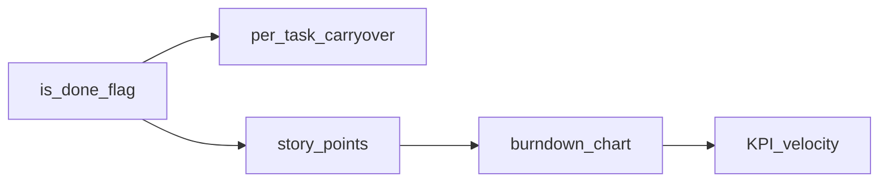

# Wave 3 — Sprint richness (chain plan)

**Dependency chain — do not jump to burndown/KPI first.**  
Each step: size, when to write a deeper plan, and acceptance sketch.

Sprints baseline: ADR 0008 · `features/sprints` · Close supports per-task carryover targets ([`sprint-lifecycle-dialogs.tsx`](../../src/features/sprints/ui/sprint-lifecycle-dialogs.tsx); wave 3.2).

`is_done` unblocks honest Close completion independently of carryover UI; points unlock charts. Carryover-per-task can parallelize after `is_done` or after points — preferred after `is_done` so completion checkboxes stay trustworthy.

---

## 3.1 Column `is_done` flag — **S–M** (light plan)

### Goal

Mark which column(s) count as Done on Close instead of “last column only”.

### Slices

1. Schema: `board_columns.is_done boolean default false`; constraint ≤1 done column per board **or** allow multiple (grill: single recommended for MVP lift).
2. Board settings UI to toggle Done column.
3. Close dialog: pre-check Tasks in `is_done` columns as completed (replace last-column heuristic).
4. Migration backfill: set `is_done` on max(`position`) column per board.

### Acceptance

- [x] Close recommends `is_done` columns even if not rightmost.
- [x] Existing Boards get sensible backfill.
- [x] SPEC Deferred row cleared.

---

## 3.2 Per-task carryover targets on Close — **M** (own plan)

### Goal

MVP today: one target for all incomplete (Backlog or chosen Draft). Lift to per-task target (Backlog / Draft A / Draft B…).

### Slices

1. Close UI: table/list of incomplete Tasks with target select (bulk “set all to X” helper).
2. RPC `close_sprint`: accept map `task_id → carryover_sprint_id | null` instead of single `p_carryover_sprint_id` (or new overload); keep atomicity (see existing seam test `sprints-atomicity.seam.test.ts`).
3. Scope events / report consistency with multi-target.

### Acceptance

- [x] Two incomplete Tasks can go to different Drafts in one Close.
- [x] Failure rolls back; no partial Close.
- [x] SPEC Deferred row cleared.

---

## 3.3 Story points / estimates on Tasks — **M–L** (own plan + CONTEXT/ADR note)

### Goal

Optional estimate field; Sprint metrics can become points-based. MVP today is count-based (`CONTEXT.md`).

### Slices

1. Grill: Fibonacci only vs free int; null = unestimated; who can edit (Manager+ vs Contributor).
2. Schema `tasks.estimate` (int/null); activity_log field if curated.
3. Card + drawer UI; Backlog/Board optional display.
4. Close report / Active badge: sum points + unestimated count.
5. Update `CONTEXT.md` Planning glossary; short ADR if metrics semantics change.

### Acceptance

- [x] Estimate editable and visible where planned.
- [x] Reports use points when present without breaking count view.
- [x] SPEC Deferred row cleared.

**Do not** start burndown until estimate semantics locked.

---

## 3.4 Sprint burndown chart — **L** (own plan)

### Prerequisites

3.3 shipped **or** explicit alternative time series (ideal hours) grilled — prefer after points.

### Slices

1. Data: daily remaining points (or count) from `sprint_events` + commitment snapshot — may need scheduled snapshot table if events insufficient.
2. UI: closed + active Sprint report section (chart library consistent with stack — keep deps lean).
3. Free-tier: avoid high-frequency writes; snapshot at most daily.

### Acceptance

- [x] Active/closed Sprint shows readable burndown from commitment.
- [x] Empty/unestimated state explained.
- [x] SPEC Deferred row cleared.

---

## 3.5 Sprint KPI / velocity dashboards — **L–XL** (own plan)

### Prerequisites

3.3 + preferably 3.4.

### Slices

1. Product grill: which KPIs (velocity last N sprints, commitment accuracy, carryover rate).
2. Aggregate queries per Board/Team; caching posture on Free.
3. Dashboard route or Backlog “Insights” panel — Manager+ vs all viewers.

### Acceptance

- [x] At least one velocity + one quality metric shipped with i18n.
- [x] Does not imply corporate SSO/reporting export.
- [x] SPEC Deferred row cleared.

---

## Wave 3 pull checklist

- [x] Ship **3.1** before treating Close as accurate.
- [x] Ship **3.2** and/or **3.3** next (independent after 3.1).
- [x] **3.4** only after points (or alternate) locked.
- [x] **3.5** last.
