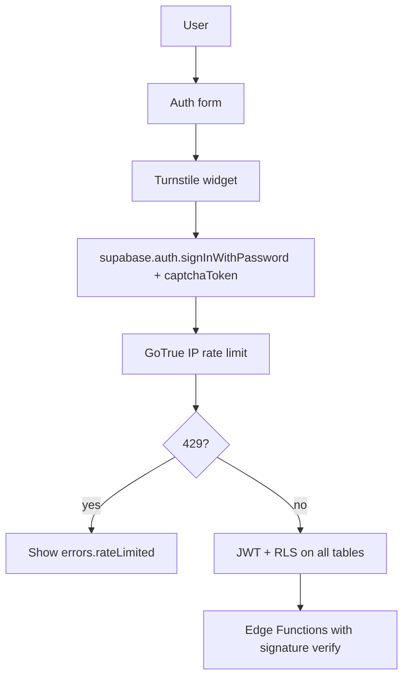

# Security hardening plan

Cross-cutting abuse prevention and auth hardening for PlotOps. **Do not pull as a single mega-PR** — ship Wave 1 items independently when explicitly prioritized.

**Context (2026-08-31):** Supabase Auth already rate-limits login/signup by IP. A React-only rate limiter on the password field is UX at best — attackers can call `/auth/v1/token` directly. CAPTCHA + tuned GoTrue limits + RLS audit are the high-impact next steps.

---

## Current posture (baseline)

| Area                           | Status                                                                      |
| ------------------------------ | --------------------------------------------------------------------------- |
| RLS on tables                  | ✅ Extensive migrations with policies                                       |
| Auth email confirmation        | ✅ `enable_confirmations = true` (`supabase/config.toml`)                   |
| Refresh token rotation         | ✅ Enabled                                                                  |
| Guest mode                     | ✅ Client-only `sessionStorage` — no Supabase anonymous users / DB abuse    |
| GitHub webhook EF              | ✅ `X-Hub-Signature-256` verification (`supabase/functions/github-webhook`) |
| Auth 429 handling              | ✅ `errors.rateLimited` + 60s submit cooldown (client UX)                   |
| CAPTCHA (Turnstile / hCaptcha) | ✅ Code + local config; **remote Dashboard secret required by ops**         |
| Password policy                | ✅ 8 chars + `lower_upper_letters_digits`; `secure_password_change = true`  |
| Security Advisor audit         | ⚠️ MCP `get_advisors` blocked (permission denied) — manual triage below     |

### Supabase Auth rate limits (GoTrue)

Configured locally in `[auth.rate_limit]` (`supabase/config.toml`). On **remote PlotOps**, tune in Dashboard → **Authentication → Rate Limits**.

| Setting               | Local default    | Notes                            |
| --------------------- | ---------------- | -------------------------------- |
| `sign_in_sign_ups`    | 12 / 5 min / IP  | Lowered from 30 (Wave 1)         |
| `token_verifications` | 30 / 5 min / IP  | OTP / magic link verify          |
| `token_refresh`       | 150 / 5 min / IP | Session refresh                  |
| `email_sent`          | 2 / hour         | Local SMTP testing               |
| `anonymous_users`     | 30 / hour / IP   | N/A — anonymous sign-in disabled |

Platform quotas also apply (OTP/hour, verify/hour, etc.). See [Production checklist → Rate limiting](https://supabase.com/docs/guides/deployment/going-into-prod#rate-limiting-resource-allocation--abuse-prevention).

**Limitation:** limits are **per IP**, not per email — distributed credential stuffing on one account is not fully covered without CAPTCHA or MFA.

---

## Flow (target state)

---

## Wave 1 — Quick wins (high impact)

**Size:** mostly **S** (1–2 days total, split PRs). Pull when hardening auth before wider launch.

### 1.1 Cloudflare Turnstile on auth forms — **S**

- [x] Create Turnstile widget (Dashboard or skill `turnstile-spin`) — **ops:** production widget + remote Dashboard secret.
- [x] Enable in Supabase Dashboard → **Auth → Bot and Abuse Protection → CAPTCHA** (secret key) — **human/ops**.
- [x] Uncomment / configure `[auth.captcha]` in `supabase/config.toml` for local Docker.
- [x] Add `@marsidev/react-turnstile` to `login-form.tsx`, `sign-up-form.tsx` (no password-reset UI yet).
- [x] Pass `options: { captchaToken }` to `signInWithPassword` / `signUp`.
- [x] Env: `VITE_TURNSTILE_SITE_KEY` (publishable); secret stays in Supabase only.
- [x] Docs: [Enable CAPTCHA Protection](https://supabase.com/docs/guides/auth/auth-captcha), `docs/SUPABASE.md` → Turnstile.

**Files:** `src/features/auth/ui/login-form.tsx`, `sign-up-form.tsx`, `src/features/auth/api/auth-api.ts`, `src/features/auth/ui/auth-turnstile.tsx`.

### 1.2 Better 429 UX — **XS**

- [x] Add `errors.rateLimited` to `src/app/locales/auth/en.json` + `ru.json`.
- [x] Map HTTP 429 and `over_request_rate_limit` in `getAuthErrorKey` (`auth-api.ts`).
- [x] Disable submit button briefly after 429 (60s client UX).

### 1.3 Tune auth config — **XS**

- [x] Lower `sign_in_sign_ups` to 12 in `config.toml`; **mirror on remote** via Dashboard — **human/ops**.
- [x] `minimum_password_length = 8` + `password_requirements = "lower_upper_letters_digits"`.
- [x] `secure_password_change = true` (re-auth before password change).

### 1.4 Security Advisor audit — **XS**

- [x] Run Supabase MCP `get_advisors` on project ref `ijcelrdcygzyzhcijkhe` (PlotOps only) — **blocked:** MCP permission denied (2026-08-31); re-auth MCP or run from Dashboard → Database → Security Advisor.
- [x] Manual migration triage (MCP fallback): see `[advisor-triage-2026-08-31.md](advisor-triage-2026-08-31.md)` and export `[advisor-export-2026-08-31.json](advisor-export-2026-08-31.json)`.

**Skills / MCP:** `supabase` skill (security checklist), MCP `get_advisors`, `search_docs`.

---

## Wave 2 — Infrastructure

**Size:** **S–M**. Pull after Wave 1 or in parallel if ops bandwidth allows.

**Runbook (Dashboard steps):** [`wave-2-runbook.md`](wave-2-runbook.md)

| Item                               | Where                         | Purpose                                           | Status                                     |
| ---------------------------------- | ----------------------------- | ------------------------------------------------- | ------------------------------------------ |
| Network Restrictions               | Supabase Dashboard → Database | Restrict DB connections by IP/CIDR                | ☐ ops — see runbook §2                     |
| SSL enforcement                    | Database settings             | Require SSL for Postgres clients                  | ☐ ops — see runbook §3                     |
| MFA on Supabase org accounts       | Supabase Dashboard            | Protect project admin access                      | ☐ ops — see runbook §4                     |
| Custom SMTP for auth emails        | Auth → SMTP                   | Trusted sender domain; separate email rate limits | ☐ ops — see runbook §5                     |
| MFA for app users (TOTP)           | Auth → MFA (Pro)              | Optional for sensitive accounts                   | ☐ remote Dashboard; ✅ local `config.toml` |
| `get_advisors` in CI / pre-release | GitHub Actions or manual gate | Regression on new migrations                      | ✅ PR + post-migrate (`--fail-on error`)   |

---

## Wave 3 — Edge / scale (on pull only)

| Item                                                      | When                                     | Notes                              |
| --------------------------------------------------------- | ---------------------------------------- | ---------------------------------- |
| Cloudflare WAF rate limiting                              | Public high-traffic deploy on Cloudflare | CDN-level throttle before Supabase |
| Auth hooks (`custom_access_token`, `before_user_created`) | Custom claims or signup rejection        | Beta feature; test locally first   |
| Per-endpoint Edge Function rate limits                    | Custom public EFs beyond auth            | e.g. future user-facing APIs       |

---

## What not to rely on

| Approach                                             | Why                                                                |
| ---------------------------------------------------- | ------------------------------------------------------------------ |
| React-only debounce / localStorage counters on login | Bypassed via direct API calls to Supabase Auth                     |
| Custom Edge Function wrapper for every login         | Duplicates GoTrue; CAPTCHA is the intended extension point         |
| App-wide REST rate limiter in frontend               | Supabase platform limits + RLS are the correct layers for Data API |

Client-side submit debounce is fine for **UX**, not security.

---

## Tools reference

| Task                            | Tool                                                  |
| ------------------------------- | ----------------------------------------------------- |
| RLS / SECURITY DEFINER audit    | Supabase MCP `get_advisors`                           |
| Auth / CAPTCHA docs             | Supabase MCP `search_docs`                            |
| Turnstile end-to-end setup      | Skill `turnstile-spin`                                |
| PR security review              | Skill `/review-security` (`security-review` subagent) |
| Postgres hardening              | Skill `supabase-postgres-best-practices`              |
| Supabase security checklist     | Skill `supabase`                                      |
| Cloudflare WAF / Turnstile docs | MCP `plugin-cloudflare-cloudflare-docs`               |

---

## Related docs

- `[docs/SUPABASE.md](../SUPABASE.md)` — local/remote Supabase workflow, PlotOps project ref, Turnstile setup
- `[docs/SPEC.md](../SPEC.md)` → Row Level Security (RLS) section
- Supabase [Production checklist](https://supabase.com/docs/guides/deployment/going-into-prod)
- Supabase [Auth CAPTCHA](https://supabase.com/docs/guides/auth/auth-captcha)
